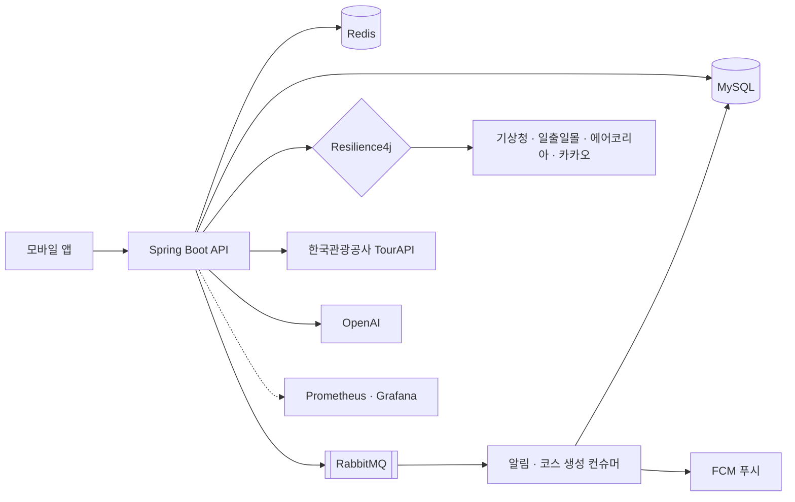

# Pic N Go · Backend

> 날씨·시간대 조건에 맞는 사진 촬영 장소 추천, 출사 코스 생성 앱

<!-- 앱 화면 3~4장 (가로로 나란히) -->
<!--  -->

- **기간** 2026.06 ~ 현재
- **팀** 4인 (풀스택) · 백엔드 중심 참여
- **서비스** 원스토어 출시 · [앱 다운로드](https://m.onestore.co.kr/v2/ko-kr/app/0001008651)
- **출품** 2026 관광데이터 활용 공모전
- **참고** 설계 배경은 포트폴리오 PDF, 이 문서는 코드 위치와 검증 방법 위주

<br>

## 기술 스택

| 구분 | 사용 기술 |
| --- | --- |
| Language · Framework | Java 21, Spring Boot 4, Spring Data JPA |
| Database · Cache | MySQL, Redis, Flyway |
| Messaging | RabbitMQ, FCM |
| 장애 대응 | Resilience4j |
| Infra | AWS EC2, Docker, GitHub Actions |
| 모니터링 · 테스트 | Prometheus, Grafana, k6, JUnit |
| 외부 연동 | 카카오 로컬·길찾기, 기상청 예보, 일출일몰, 에어코리아, 한국관광공사 TourAPI, OpenAI |

<br>

## 아키텍처



<br>

## 주요 작업

| 작업 | 결과 | 설계 배경 |
| --- | --- | --- |
| 알림 스케줄러 비동기 전환, 중복 발송 차단 | 실행 약 50초 → 1.9초, 500건 테스트 중복 발송 0건 | 포트폴리오 p.4 |
| 외부 API 장애 격리 | 기상청 차단 중 일출일몰 15,542건 100% 성공, 처리량 3.4배 | 포트폴리오 p.6 |
| 검색 6단계 폴백, PostgreSQL 미도입 | p95 9,880ms → 223.6ms, 적중률 36.5% → 90.4% | 포트폴리오 p.2 |
| AI 코스 기획 | 요청 응답 5~10초 → 45ms, 장소는 DB에서만 선택 | 포트폴리오 p.3 |
| 차량 진입 불가 장소 길찾기 보정 | 대표 진입점 단일성을 락 없이 유지 | 포트폴리오 p.5 |
| 배포 안정성 | Flyway 도입, 테스트 438개, 배포 전 수동 SQL 0건 | |

<br>

## 판단 기록

| 결정 | 검토한 대안 | 이유 | 근거 |
| --- | --- | --- | --- |
| MySQL 유지 (pgvector 미도입) | PostgreSQL 이전 | 도입 근거(성능, 오타 보정, 벡터 색인) 모두 MySQL로 해결 | FULLTEXT로 DB 쿼리 4~5초 → 37.9ms, 문자열 단계로 오타 93~100% 적중, 장소 수천 건이라 전수 비교로 충분 |
| 서킷을 호스트 단위로 분리 | 클래스 단위 | 같은 클래스라도 호스트가 다르면 장애도 따로 발생 | 기상청 차단 중 일출일몰 15,542건 100% 성공 |
| 관광공사 동기화 배치는 타임아웃만 | 서킷 적용 | 서킷이 열리면 빈 데이터를 정상으로 저장 | |
| OpenAI 임베딩 호출은 타임아웃만 | 서킷 적용 | 검색 마지막 단계 전용, 실패해도 빈 결과 | 앞 단계가 모두 0건일 때만 호출 |
| 알림은 저장 성공 시에만 발송 | 발송 후 저장 | At-Least-Once 재전달로 인한 중복 발송 차단 | 500건 테스트 중복 발송 0건 |
| 알림 컨슈머 트랜잭션 제거 | 트랜잭션 유지 | 유니크 위반 → 롤백 → 무한 재전달 | |
| 코스 생성은 202 Accepted | 동기 응답 | 5~10초 동안 톰캣 스레드 점유 | 요청 응답 45ms |
| LLM은 의도 분석·문구 작성만 | LLM이 장소까지 추천 | 존재하지 않는 장소 생성 | 장소는 DB의 실제 장소에서만 선택 |
| 대표 진입점을 단일 참조 컬럼으로 | 비관적 락, UNIQUE 제약 | 락은 외부 API 호출 중 행 잠금, UNIQUE는 비대표 후보까지 차단 | |
| 길찾기 API 오류는 저장 안 함 | 결과 없음으로 저장 | 일시 장애가 영구 실패로 남음 | 다음 요청에서 재시도 |

<br>

## 코드 가이드

| 영역 | 핵심 클래스 | 테스트 |
| --- | --- | --- |
| 알림 | `NotificationScheduler`, `NotificationService`, `NotificationCacheService`, `NotificationPushProducer`, `NotificationPushConsumer`, `RabbitMQConfig` | `NotificationSchedulerTest` |
| 외부 API · 서킷 | `WeatherClient`, `AirQualityClient`, `KakaoLocalSearchClient`, `KakaoDirectionsClient`, `TourApiClient`, `ExternalApiCircuitBreakerConfig` | `WeatherClientTest` |
| 코스 | `CourseFacade`, `CourseService`, `CourseWeatherService` | `CourseFacadeTest` |
| 길찾기 · 이동시간 | `SpotAccessPoint`, `RouteCacheService` | |
| 검색 | `SpotService`(`searchInStages`), `SpotRepository`, `FullTextKeyword`, `EditDistance`, `SpotEmbeddingService`, `SearchProperties` | `SpotServiceFullTextTest`, `SpotServiceNormalizeFallbackTest`, `SpotServiceSimilarFallbackTest`, `SpotServiceFuzzyFallbackTest`, `SpotServiceSemanticFallbackTest`, `SpotServiceSearchMetricsTest`, `EditDistanceTest` |
| DB 마이그레이션 | `src/main/resources/db/migration` (V1 ~ V25) | `FlywayMigrationOnMySqlTest` |

<br>

## 검증 방법

### 테스트

```bash
./gradlew test
```

- 기본 테스트는 H2에서 실행
- H2가 지원하지 않는 마이그레이션(FULLTEXT ngram 인덱스, 생성 컬럼, 프로시저)은 실제 MySQL에서 따로 검증
- 환경 변수가 있을 때만 실행, 검사용 스키마를 만들었다가 삭제하므로 기존 DB 영향 없음

```bash
MIGRATION_TEST_URL="jdbc:mysql://127.0.0.1:3306" \
MIGRATION_TEST_USER=picngo MIGRATION_TEST_PASSWORD=<비밀번호> \
./gradlew test --tests "*FlywayMigrationOnMySqlTest"
```

### 검색 평가 데이터셋

- 검색어 1,393건과 정답을 측정 전에 확정
- 시드 고정, 검색 단계를 하나씩 켜며 측정
- 상위 20건 안에 정답이 있으면 적중

```bash
# 1) 정답표 생성: 설명문이 있는 장소 200곳에서 검색어와 정답 파생
node search-eval/generate-goldenset.js --sample 200 --seed 20260911

# 2) 단계마다 앱을 다시 띄우고 같은 정답표로 측정
./gradlew bootRun
node search-eval/evaluate-quality.js --label "A: LIKE"
```

단계별 환경 변수 (앞 단계 설정은 유지)

| 단계 | 추가 환경 변수 |
| --- | --- |
| +FULLTEXT | `SEARCH_ENGINE=FULLTEXT` |
| +정규화 | `SEARCH_NORMALIZE_FALLBACK=true` |
| +유사도 | `SEARCH_SIMILAR_FALLBACK=true` |
| +편집 거리 | `SEARCH_FUZZY_FALLBACK=true` |
| +의미검색 | `SEARCH_SEMANTIC_FALLBACK=true` (`OPENAI_API_KEY` 필요, `POST /admin/embeddings/backfill`로 임베딩 먼저 생성) |

| 단계 | LIKE | +FULLTEXT | +정규화 | +유사도 | +편집 거리 | +의미검색 |
| --- | --- | --- | --- | --- | --- | --- |
| 누적 적중률@20 | 36.5% | 36.1% | 55.3% | 84.8% | 88.1% | 90.4% |

<sub>검색어 1,393건 · 후보 장소 2,947건(설명 보유) · 시드 20260911</sub>

### 장애 주입 부하 테스트 (k6)

- 외부 API를 5초 지연 응답하는 목 서버(`DelayedKakaoMockServer`)로 교체
- 일출일몰 경로만 지연 없이 응답

| 스크립트 | 확인 내용 |
| --- | --- |
| `circuit-breaker.js` | 카카오 로컬 검색 지연 시 서킷이 열려 즉시 실패로 전환되는지 |
| `circuit-breaker-weather.js` | 기상청 차단 중에도 같은 클래스의 일출일몰 호출이 정상인지 |
| `circuit-breaker-directions.js` | 길찾기 지연 시 실패로 끊기기까지 걸리는 시간 |

```bash
# 터미널 1: 지연 목 서버 (:9999)
java load-test/mock-server/DelayedKakaoMockServer.java

# 터미널 2: loadtest 프로파일 (목 서버 URL, 테스트 엔드포인트 인증 면제)
SPRING_PROFILES_ACTIVE=loadtest ./gradlew bootRun

# 터미널 3
k6 run load-test/circuit-breaker-weather.js
```

<br>

## 다음 과제

- 검색 p95: 목표 200ms 미만, 현재 223.6ms
- 평가 데이터셋의 동의어(15건), 자연어(51건) 유형은 표본이 작음
- 의미검색은 앞 단계 결과 0건일 때만 동작. 기준을 넓히면 OpenAI 호출이 늘어나므로 적중률과 호출 비용을 측정한 뒤 결정 예정
- OpenAI 임베딩 호출에 서킷 없음. 호출 빈도와 실패율이 늘면 추가 예정
- 진입점 보정에 동시 요청이 몰리면 대표는 하나로 유지되지만, 참조되지 않는 후보 행이 남을 수 있음
- 서킷 임계값(타임아웃 3초, 최소 호출 10건), 이동시간 추정식(우회율 1.3, 구간별 속도)은 실측이 아닌 추정치

<br>
