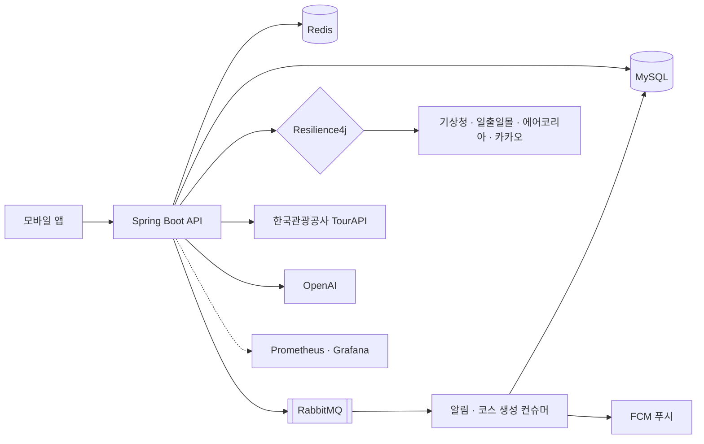

# Pic N Go · Backend

> 날씨와 시간대 조건에 맞는 사진 촬영 장소를 추천하고, 출사 코스를 짜주는 앱

<!-- 앱 대표 이미지 또는 화면 3~4장 (가로로 나란히) -->
<!--  -->

- **기간** 2026.06 ~ 현재
- **팀** 4인 (풀스택) · 백엔드 중심으로 참여
- **서비스** 원스토어 출시 · [앱 다운로드](https://m.onestore.co.kr/v2/ko-kr/app/0001008651)
- **출품** 2026 관광데이터 활용 공모전

 

## 기술 스택

| 구분 | 사용 기술 |
| --- | --- |
| Language · Framework | Java 21, Spring Boot 4, Spring Data JPA |
| Database · Cache | MySQL, Redis, Flyway |
| Messaging | RabbitMQ, FCM |
| 장애 대응 | Resilience4j |
| Infra | AWS EC2, Docker, GitHub Actions |
| 모니터링 · 테스트 | Prometheus, Grafana, k6, JUnit |
| 외부 연동 | 카카오 로컬·길찾기, 기상청 예보, 일출일몰, 에어코리아, 한국관광공사 TourAPI, OpenAI |

 

## 아키텍처

- 서버는 Spring Boot 애플리케이션 하나로 구성하고, EC2에서 Docker로 MySQL, Redis, RabbitMQ와 함께 운영합니다.
- 오래 걸리거나 실패해도 다시 처리할 수 있는 작업(알림 발송, AI 코스 생성)은 RabbitMQ로 분리했습니다.
- 외부 API는 장애가 서비스 전체로 번지지 않도록 Resilience4j 서킷브레이커를 거쳐 호출합니다.

 

## 주요 작업

### 1. 알림 스케줄러 비동기 전환과 중복 발송 차단

**문제**
- 하루 4회 도는 알림 스케줄러가 기상청 예보 조회와 FCM 발송을 차례로 호출해 한 번에 약 50초가 걸렸습니다.
- 발송을 큐로 옮기면 RabbitMQ의 At-Least-Once 재전달 때문에 같은 알림이 두 번 나갈 수 있었습니다.

**해결**
- 구간별로 시간을 재서 병목이 DB가 아니라 외부 API 호출(네트워크 I/O)이라는 것을 먼저 확인했습니다.
- 가까운 좌표끼리 묶어 예보를 한 번만 조회하고 캐싱했습니다. 알림 수신 설정을 켠 사용자는 Redis Set으로 관리해 매번 DB 전체를 읽지 않게 했습니다.
- FCM 발송은 RabbitMQ 컨슈머로 넘겼습니다.
- 알림 유형, 사용자, 장소, 날짜, 시간대로 복합 멱등키를 만들고, DB 저장에 성공한 경우에만 발송하도록 순서를 바꿨습니다.
- 유니크 제약 위반이 나면 롤백과 함께 메시지가 큐로 되돌아가 무한 재전달되는 문제가 있었습니다. 컨슈머의 트랜잭션을 걷어내고, 중복은 정상 처리로 간주해 메시지를 소비하도록 바꿨습니다.

**결과**
- 스케줄러 실행 시간 **약 50초 → 1.9초**
- 스케줄러 DB 쿼리 **200회 → 2회**
- 500건 동시 발송 테스트(JUnit)에서 **중복 저장·중복 발송 0건**

 

### 2. 외부 API 장애 격리

**문제**
- 외부 API를 동기로 호출하고 있어서, 느린 API 하나가 톰캣 스레드를 붙잡으면 관련 없는 요청까지 함께 느려졌습니다.

**해결**
- 서킷 경계를 클래스 단위가 아니라 **같이 장애가 나는 단위(호스트)** 로 나눴습니다.
  - 같은 클래스 안에 있어도 호스트가 다른 기상청과 일출일몰 API는 서킷을 분리했습니다.
  - 같은 호스트를 쓰는 단기예보와 중기예보는 실패 기록을 한 서킷에서 공유하게 했습니다.
- 모든 호출에 서킷을 붙이지는 않았습니다. 실패했을 때 무슨 일이 생기는지를 보고 정했습니다.
  - 한국관광공사 동기화 배치는 서킷이 열리면 빈 데이터를 정상처럼 저장하고 완료 처리하는 문제가 있어, 서킷 대신 타임아웃 예외로 바로 멈추게 했습니다.
  - OpenAI 임베딩 호출은 검색의 마지막 단계에서만 쓰이고 실패해도 빈 결과로 끝나서, 타임아웃만 두었습니다.
- k6로 장애를 주입하던 중, 서킷이 호출을 차단했는데도 응답이 433ms로 느린 현상을 발견했습니다. 추적해 보니 예외가 날 때마다 스택트레이스 전체를 디스크에 쓰는 로그 I/O가 병목이었고, 한 줄 로그로 바꿨습니다.

**결과**
- 기상청 API를 차단한 상태에서 일출일몰 조회 **15,542건 100% 성공**
- 로그 **59MB → 8.6MB**, 처리량 **3.4배**

> 서킷 임계값(타임아웃 3초, 최소 호출 10건)은 실측 트래픽이 아니라 권장값을 기준으로 잡은 추정치입니다.

 

### 3. 검색 6단계 폴백과 평가 데이터셋

**문제**
- 검색이 `LIKE '%키워드%'` 구조라 인덱스를 쓰지 못해 p95가 9,880~14,920ms였습니다.
- 띄어쓰기, 자판 오타, 뜻이 같은 다른 단어로는 장소를 거의 찾지 못했습니다.
- 벡터 검색을 위해 PostgreSQL(pgvector)로 옮기는 것을 검토했습니다.

**평가 데이터셋부터 만들었습니다**
- 처음에는 Claude가 만든 검색 테스트를 썼는데, 실행할 때마다 새로 발견한 예외 케이스에 맞춰 테스트 코드가 바뀌었습니다. 측정 도구가 매번 달라지니 어떤 변경이 효과가 있었는지 판단할 수 없었습니다.
- 실제 장소 이름에서 오타, 공백 변형 등을 만들어 검색어 1,393건과 정답을 미리 확정했습니다.
- 시드를 고정하고, 검색 단계는 한 번에 하나씩 켜고 서버를 재시작해서 측정했습니다. 조건이 두 개 이상 바뀌면 어느 단계 덕분에 좋아졌는지 알 수 없기 때문입니다.

**PostgreSQL을 도입하지 않았습니다**

도입 근거 세 가지를 하나씩 측정해 보고 모두 기각했습니다.

| 도입 근거 | 측정 결과 |
| --- | --- |
| 성능 | MySQL FULLTEXT(ngram) 인덱스만으로 DB 쿼리가 4~5초에서 평균 37.9ms로 줄었습니다 |
| 오타 보정 | 정규화, ngram 유사도, 편집 거리만으로 공백 제거 100%, 자판 오타 93.0%, 종성 누락 94.4%까지 찾았습니다 |
| 벡터 색인 | 장소가 수천 건 규모라 임베딩 코사인 유사도를 전수 비교해도 충분했습니다 |

**6단계 폴백**

앞 단계에서 결과를 찾지 못하면 다음 단계로 넘어갑니다. 의미검색은 앞 단계가 모두 0건일 때만 동작합니다.

| 단계 | LIKE | +FULLTEXT | +정규화 | +유사도 | +편집 거리 | +의미검색 |
| --- | --- | --- | --- | --- | --- | --- |
| 누적 적중률@20 | 36.5% | 36.1% | 55.3% | 84.8% | 88.1% | 90.4% |

검색어 1,393건 · 후보 장소 2,947건(설명 보유) · 시드 20260911 · 상위 20건 안에 정답이 있으면 적중

**의미검색을 빼자는 결론을 뒤집은 과정**
- 처음 임베딩 결과가 좋지 않자, Claude는 로컬 임베딩 모델의 성능을 원인으로 봤습니다. 그 판단대로 OpenAI API로 교체했지만 결과가 같았고, Claude는 의미검색을 넣지 않는 게 낫다고 결론 냈습니다.
- 모델을 바꿔도 정확도가 똑같다는 점이 이상해서 DB를 직접 확인했습니다. 임베딩에 들어가야 할 장소 설명(overview)이 전부 null이었습니다. 한국관광공사 데이터를 받아오는 동기화 로직이 설명 항목을 저장하지 않고 있었습니다.
- 동기화를 고친 뒤 다시 측정하니, 의미검색을 켰을 때 동의어 검색어 적중률이 13.3%에서 46.7%로, 자연어 검색어는 45.1%에서 54.9%로 올랐습니다.

**결과**
- 검색 p95 **9,880ms → 223.6ms** (k6, 30VU)
- 적중률 **36.5% → 90.4%**, 결과 없음 비율 **62.2% → 0%**
- 추가 인프라 없이 컬럼 1개와 인덱스 3개만 추가

 

### 4. AI 코스 기획

**문제**
- 코스 하나를 만들려면 자연어 분석, 장소 검색, 예보 조회, 동선 계산을 차례로 거쳐야 해서 5~10초가 걸렸습니다. 요청을 동기로 받으면 그동안 톰캣 스레드를 붙잡습니다.
- LLM에게 장소 추천까지 맡기면 존재하지 않는 장소를 만들어냈습니다.

**해결**
- 요청은 큐에 넣고 `202 Accepted`와 `taskId`를 바로 돌려줍니다. 컨슈머가 코스를 저장한 뒤 FCM 딥링크로 완료를 알립니다.
- LLM은 사용자의 의도를 분석하고 팁 문구를 쓰는 일만 맡습니다. 장소는 자체 DB에 있는 실제 장소에서만 고르고, 동선은 Haversine 거리와 최근접 이웃 알고리즘으로 계산합니다.
- 외부 API를 여러 번 호출하던 코스 상세 조회는 Redis에 캐싱했습니다.

**결과**
- 코스 생성 요청 응답 **5~10초 → 45ms**
- 장소를 DB에서만 가져오므로, 존재하지 않는 장소나 이상한 좌표가 코스에 들어갈 수 없는 구조
- 코스 상세 조회 **12.1초 → 40ms** (캐시 적중 시)

 

### 5. 차가 들어갈 수 없는 장소의 길찾기 보정

**문제**
- 해변이나 산 정상처럼 차가 바로 닿을 수 없는 장소는 카카오 길찾기가 도로가 아니라는 이유로 실패했습니다.

**해결**
- 길찾기가 실패하면 그때 장소 이름으로 주차장, 매표소 순서로 검색해 2km 안에 있는 첫 후보를 진입점으로 씁니다.
- 검색 결과를 찾음, 없음, 오류 세 가지로 나눴습니다. 일시적인 API 오류를 없음으로 저장하면 영구 실패로 굳어버리기 때문에, 오류는 저장하지 않고 다음 요청에서 다시 시도합니다.
- 진입점은 장소 테이블의 컬럼으로 두지 않고 `SpotAccessPoint` 테이블로 분리했습니다. 지금은 카카오 검색으로 장소당 하나만 만들지만, 관리자 지정이나 사용자 제보가 추가되면 스키마를 바꾸지 않고 후보를 쌓을 수 있습니다.
- 대표 진입점이 장소당 하나라는 조건은 락 대신 구조로 지켰습니다. 외부 API를 호출하는 동안 행 잠금을 쥐지 않도록, 장소(Spot)가 대표 진입점 하나를 참조하는 컬럼을 두었습니다.
- 이동시간은 Redis 캐시(좌표 약 100m 단위, 7일), 카카오 길찾기 순으로 가져옵니다. 카카오가 응답하지 않을 때만 직선거리에 도로 우회율 1.3을 곱하고 구간별 속도(시내 22, 국도 40, 도시고속 55, 고속도로 85km/h)로 나눠 추정합니다.

 

### 6. 정합성과 배포

- **낙관적 락 재검증** `@Version`을 붙인 뒤 실제 버전 값을 확인해 보니, 하위 엔티티가 바뀌어도 상위 엔티티의 버전이 오르지 않아 락이 아무것도 막지 못하고 있었습니다. 고치기 전에 재현 테스트 3개를 먼저 작성했고, 충돌 시 409와 새로고침 안내를 반환하게 바꿨습니다.
- **스키마 드리프트** 운영 배포가 로그 없이 멈춘 원인을 추적해, 스키마 변경이 운영 DB에 반영되지 않았다는 것을 찾았습니다. Flyway를 도입하고, 운영 DB 문법을 검증하는 MySQL 전용 테스트를 따로 두어 결함 6건을 고쳤습니다.
- 전체 테스트 **438개**, 배포 전 수동 SQL **0건**

 

## 다음 과제

- 검색 p95 목표는 200ms 미만이었지만 현재 223.6ms입니다.
- 의미검색은의 적중률은 46~50% 밖에 되지않습니다. 조금 더 높일 수 있는 방안을 찾을 계획입니다.
- OpenAI 임베딩 호출에는 서킷브레이커가 없습니다. 호출이 잦아지고 실패율이 문제가 되면 추가할 계획입니다.
- 진입점 보정에 동시 요청이 몰리면 대표는 하나로 유지되지만, 아무도 참조하지 않는 행이 남을 수 있습니다.
- 이동시간 추정식의 우회율과 구간별 속도는 카카오 실측값과 비교 검증하지 않은 추정치입니다.

 
